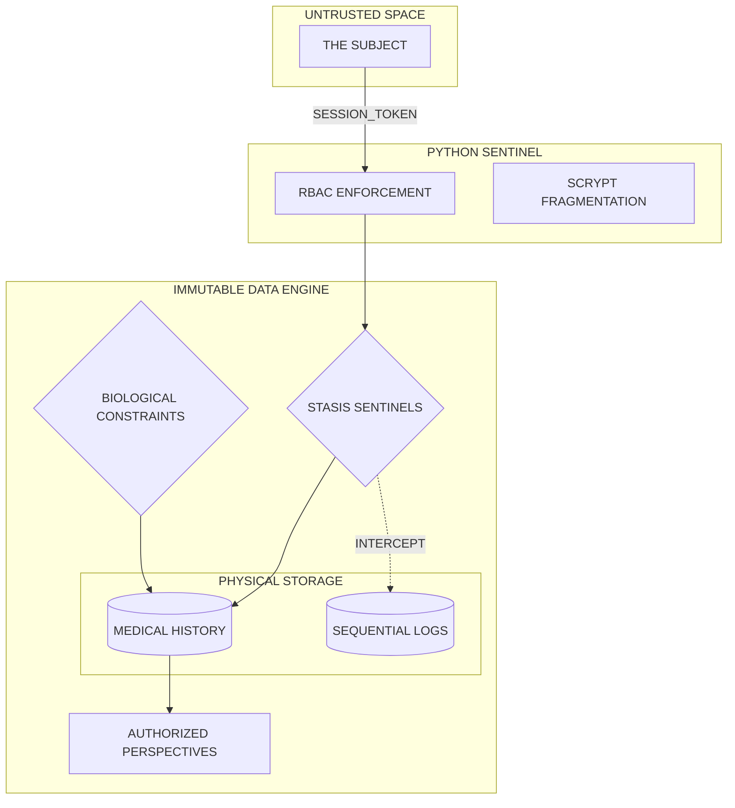

# PROJECT SECOND-LIFE: THE IMMUTABLE LEDGER

**DATABASE SYSTEMS INTERFACE | ARCHIVE-7 | ZERO-TRUST ARCHITECTURE**

Second-Life is not a hospital application. It is a high-integrity vault for biological data. Built on the principle of absolute permanence, it utilizes deep-layer DBMS enforcement to ensure that once a record enters the system, it becomes a permanent part of the digital timeline. Modification is impossible. Deletion is a violation of protocol.

---

## SYSTEM ARCHITECTURE: THE TRIAD PERIMETER

The architecture is designed to compartmentalize risk and centralize truth within the MySQL engine.

---

## CORE DIRECTIVES

### THE PERMANENCE PROTOCOL (DBMS LAYER)
*   **STASIS TRIGGERS**: Custom BEFORE UPDATE and BEFORE DELETE sentinels are embedded directly into the schema. They monitor the medical tables with zero latency, aborting any attempt to alter the past with a 45000-state signal.
*   **BIOLOGICAL VERIFICATION**: Every entry must survive the Domain Integrity check. Data points such as body temperature and pulse are bounded by strict physiological constraints. Out-of-bounds data is purged at the engine level before it can corrupt the ledger.
*   **ATOMIC CONVERSION**: The discharge process is an atomic transaction. A patient's release triggers a simultaneous revocation of all active provider access, ensuring that temporal consent expires the moment physical presence ends.

### THE SECURITY PERIMETER (APPLICATION LAYER)
*   **INPUT NEUTRALIZATION**: 100% of the interface communicates via parameterized queries. The system assumes all incoming strings are hostile, neutralizing SQL injection vectors before they reach the execution buffer.
*   **CREDENTIAL FRAGMENTATION**: We do not store passwords. We store high-entropy Scrypt fragments. Even in the event of a total database leak, the subjects' identities remain mathematically shielded.
*   **FORENSIC AUDITING**: A sequential audit chain captures every raw SQL operation executed by the system. This log is a mirroring reflection of the database's activity, used for post-incident reconstruction.

---

## PROTOCOL CAPABILITIES

| DESIGNATION | ACCESS RIGHTS | DATA INTERACTION |
| :--- | :--- | :--- |
| SUBJECT | PATIENT | Manage temporal consent, view personal immutable history. |
| OPERATOR | PROVIDER | Append to ledger, link correction chains, view authorized subjects. |
| OVERSEER | ADMIN | Full system audit, workload analytics, direct SQL override. |

---

## EVOLUTIONARY PROTOCOLS (FUTURE PHASE)

*   **RESOURCE ENCAPSULATION**: Implementation of PL/SQL-style Packages to encapsulate pharmacy inventory logic within the database kernel.
*   **AUTONOMOUS RISK SCORING**: Stored functions designed to analyze historic vitals and output a singular health-risk coefficient without external processing.
*   **NEURAL INTERFACE**: D3-driven visualization of recovery vectors, pulling directly from the Active Patient Views.

---

## INITIALIZATION

1.  **ESTABLISH SCHEMA**
    mysql -u system_admin -p < database/schema.sql

2.  **DEFINE PERIMETER**
    export SECRET_KEY=0x_SECURE_VOID_KEY

3.  **EXECUTE PROTOCOL**
    python app.py

---

**STATUS: SYSTEM ONLINE | DATA INTEGRITY: ABSOLUTE | MODIFICATION: PROHIBITED**
